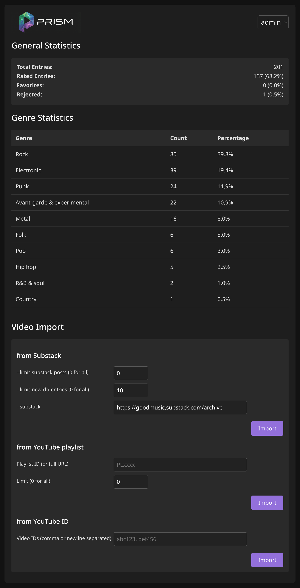

# GOODMUSIC prism

Tools for collecting YouTube music videos from Substack or other sources, seeding a Firestore catalog, and rating/filtering videos via a small Flask UI & export collection to YouTube-playlists.

Goal: Create your own MTV! 🎶

## Screenshots
<table>
  <tr>
    <th>rate</th>
    <th>play</th>
    <th>admin</th>
  </tr>
  <tr>
    <td valign="top"></td>
    <td valign="top"></td>
    <td valign="top"></td>
  </tr>
</table>

## Concept

- Ingest musicvideo: extract YouTube IDs, fetch metadata, and store them as documents in Firestore (`musicvideos` collection). The source of the videos can be Substacks (this is how this project originated), YouTube playlists, or manual input of specific videos.
  - Ingestion also includes categorization of videos into genres. This uses the publicly available AI-models of Google and can be configured ([Configuration](#configuration))

  - Import methods can be found in admin section

- rate-mode presents unrated items (user watches new videos & rates/categorizes)
- play-mode for filter selection & playback
  - Also if needed: Export the desired selection to YouTube-Playlist


## Repository layout

- `prism-gui.py` — Flask app that renders the admin, rating (`/rate`), and play (`/play`) pages using Firestore data.
- `scrape_to_firestore.py` — Scrapes Substack posts, pulls YouTube metadata, predicts genres/artist/track, and writes new videos to Firestore. This script can also be called from the GUI.
- `templates/` — HTML templates for the Flask UI.
- `static/` — CSS, JS, and static image assets.
- `Dockerfile` — Container image build for deployment.
- `update-google-cloud-run.sh` — Deployment helper for Cloud Run.
- `requirements.txt` — Python dependencies.
- `prism-ss-*.png` — UI screenshots.

Not needed except if you are really curious:

* `ingestion.py` — Shared ingestion helpers (Firestore init, YouTube auth, Gemini predictions, audio handling).

- `update-genre.py` — Re-evaluates genre classification for existing Firestore docs.
- `update-db-fields.py` — Backfills missing artist/track/ai_model fields in Firestore.
- `migrate_ratings.py` — Migrates legacy root-level ratings into per-user `ratings` maps and can backfill `rand`.
- `test-ai-model.py` — CLI for comparing Gemini model outputs on sample videos.

## Setup

### Python environment

It is strongly recommended to first setup and test the complete setup locally. Local execution triggers some authentication and authorization processes which are then needed even when running the application completely in the cloud.

Python 3.10+ and `pip` is needed.

```bash
git clone <this-repo>
cd GOODMUSIC
python -m venv venv
source venv/bin/activate
pip install -r requirements.txt
```

### Mandatory Configuration

#### Overview

Due to the nature of this project several configuration steps are needed. Here is a brief overview - more detailled explanation about each component are found in this document.

| name                 | note                                                         | local-run    | cloud-run      |
| -------------------- | ------------------------------------------------------------ | ------------ | -------------- |
| ADMIN_USER           | admin email (used for Google login admin and legacy basic auth username) | .env | Secret Manager |
| ADMIN_PASSWORD       | env-var with your admin password (legacy basic auth)          | .env         | Secret Manager |
| `client_secret.json` | file which identifies your software project (prism) against other apps (like YouTube) | project-root | Secret Manager |
| `token.pickle`       | file which contains user credentials (access token and refresh token) used by server-side YouTube API calls (ingestion/import) | project-root | Secret Manager |
| GEMINI_API_KEY       | env-var with your API-key for Google Gemini                  | .env         | Secret Manager |
| FLASK_SECRET_KEY     | env-var with a random, stable value used to sign sessions    | .env         | Secret Manager |

#### preparations for all installations

Before anything else, make sure ADC can resolve your default project (one-time setup):
1. `gcloud config set project <PROJECT_ID>`
2. If running locally, also run `gcloud auth application-default login` (Cloud Run provides ADC automatically).

You must create credentials for our app to authenticate against the YouTube API:

1. Go to **APIs & Services > Credentials**.
2. Click **Create Credentials > OAuth client ID**.
3. Select **Web app**.
4. Set **Authorised redirect URIs**
   1. http://localhost:8080/
      // Needed when running scripts locally
   2. http://localhost:8080/google/callback
      // Needed for OAuth Login for the web-app (running locally)
   3. https://\<YOUR-CLOUD-RUN-URL>/google/callback
      // Needed for OAuth Login for the web-app (running in the cloud)
5. Download the JSON file, rename it to `client_secret.json`, and place it in the project root.

6. Set **Authorised JavaScript origins** (needed for browser-based playlist export):
   1. http://localhost:8080
   2. https://<YOUR-CLOUD-RUN-URL>

Regarding token.pickle, this file contains our credentials to authenticate our individual user (not the app) against the YouTube API. It is created during the first call of server-side functions which call this API - like scraping and importing new videos. A browser window will pop up and you have to acknowledge access of our app to your YouTube-account.

1. In the running app, import new videos in the "admin"-section.
2. A browser windows will pop up and ask for confirmation of access to your YouTube account.
3. Acknowledge and `token.pickle` will be created.
4. The token.pickle will then be automatically uploaded into the cloud into the Secret Manager, so next time you'll run the application from cloud it will be available there and you can use all functions that need server-side YouTube API access (ingestion, playlist import) there

Firestore database is somewhat limited in queries which it can directly fulfill. For cases where we need more complex queries, it is needed to (auto) populate an index query. This only has to be done once.

1. Start the GUI locally and switch to "play" mode. When you press "Apply" there at the filter section, a query will be sent to the db. If it requires an query index which isn't there, it will throw an error-message in the logs.
   The app detects these specific log-messages and display them right in the GUI where you can spot them immediately.
2. So do some queries - check/uncheck the "exclude_rejected" and the "favorite_only" checkbox individually, also be sure to check a specific genre once, and you'll see two or three such error messages.
3. Click on the link in the error-message and you'll be automatically forwarded to the Cloud Console where you'll be prompted to acknowledge the new search index (just click on "create").

#### preparation for local-run installations

The easiest way to get going is just to create an .env file in the project root folder and fill it with the following environment variables:

```.env
ADMIN_USER="<admin-email>"
ADMIN_PASSWORD="<password>"
GEMINI_API_KEY="<api-key>"
FLASK_SECRET_KEY="<random-stable-secret>"
```

Also, for creating local Application Default Credentials (ADC), set your default project and run:

```bash
gcloud config set project <PROJECT_ID>
gcloud auth application-default login
```

This is needed for connecting to Firestore from your local computer.

#### preparation for cloud-run installations

To secure the Flask UI in Cloud Run without exposing credentials in deployment commands:

1. Enable [Secret Manager](#secret-manager): `gcloud services enable secretmanager.googleapis.com`

2. Create secrets we need for our app:

   ```bash
   gcloud secrets create YOUTUBE_TOKEN_PICKLE --replication-policy="automatic"
   printf "your-api-key" | gcloud secrets create GEMINI_API_KEY --data-file=-
   printf "admin-email" | gcloud secrets create ADMIN_USER --data-file=-
   printf "your-password" | gcloud secrets create ADMIN_PASSWORD --data-file=-
   printf "your-random-stable-secret" | gcloud secrets create FLASK_SECRET_KEY --data-file=-
   ```

3. You also have to upload OAuth client file you created earlier to Secret Manager with this command:
   `gcloud secrets create CLIENT_SECRET_JSON --data-file=client_secret.json`

4. Grant the Compute Engine default service account access to the secrets (replace `<PROJECT_ID>` with your project number and <SERVICE_ACCOUNT_EMAIL> with the service account email):

   ```bash
   # Project-wide read access to all secrets
   gcloud projects add-iam-policy-binding <PROJECT_ID> \
     --member="serviceAccount:<SERVICE_ACCOUNT_EMAIL>" \
     --role="roles/secretmanager.secretAccessor"
   
   # Write access only for YOUTUBE_TOKEN_PICKLE
   gcloud secrets add-iam-policy-binding YOUTUBE_TOKEN_PICKLE \
     --member="serviceAccount:<SERVICE_ACCOUNT_EMAIL>" \
     --role="roles/secretmanager.secretVersionAdder"
   ```

   If you prefer, you edit those changes also in the [Google Cloud Console](https://console.cloud.google.com/) under IAM & admin/IAM/Grant access.

### Google Cloud Services

Even when run locally, some components of the software are consumed from the cloud. Those have to be set up before starting the application.

If you don't have yet a Google account, you have to set one up. Browse to [Google Cloud Console](https://console.cloud.google.com/) and create a new project.

Install Google Cloud SDK (`gcloud`) for local Application Default Credentials.

#### Firestore Database

The application uses Firestore as the database. It's free for our usecase (the free tier gives enough allowance). You have to enable the services however for your project. Search for "firestore" and enable it. The rest will be done automatically by the application. The name of the database will be `musicvideos`.

##### Data model

Each document ID is the YouTube `video_id` (it is not stored as a field) and stores global metadata like:

- `title`, `source` (Substack URL), `genre` (AI), `artist`, `track`
- `ai_model`, `genre_ai_fidelity`, `genre_ai_remarks`
- `date_prism`, `date_substack`, `date_youtube`, `rand` (for random selection)

User-specific ratings live inside the video document under `ratings.<rating_key>`:

- `rating_music`, `rating_video`, `favorite`, `rejected`
- `rated_at`, `updated_at`
- `genre_override` (optional user-specific override)

The `users` collection stores per-user metadata:

- `role` (`admin` | `user`), `status` (`active` | `disabled`), `auth_provider`
- `rating_key` (safe field key for ratings map)

##### Multi-user setup

Any Google account can log in; users are auto-created on first login. The admin is defined by `ADMIN_USER` (and legacy basic auth uses the same username).

1. Migrate legacy ratings to the admin user (run once):

```bash
python migrate_ratings.py --add-rand
```

2. Manage users in the admin UI (delete inactive users and their ratings).

#### YouTube Data API v3

We pull metadata from the YouTube API, which is why you have to enable it as well (search for it in [Google Cloud Console](https://console.cloud.google.com/) and enable it).

Usage of this API is free, but note that you might run into quota limits of the API. This is especially true for playlist export, which consumes a lot of quota. In this case, you can re-run the export later; duplicates are skipped automatically.

Playlist export runs in the browser using OAuth for the currently logged-in user. Tokens are not stored server-side; keep the tab open while the export is running.
If the OAuth consent screen is in testing mode, add your users as test users (or publish the app) so they can authorize YouTube access.

#### Google Cloud Run

This component of the Google Cloud suite is needed only if you want to run this application completely in the cloud. After successful test of the functionality locally, you can run the script `update-google-cloud-run.sh` and the application will be uploaded into the Google Cloud and be available there to be spun up on demand if you use the app. Because of this concept, the costs of this service are ridiculously low (in the range of cents, less then 1 EUR/USD).

#### Gemini API

The API for the AI functions from Google is available in the Cloud Console. In this case, it's called "Vertex". But the cheaper option is to create an API-key at [Google AI Studio](https://aistudio.google.com/) and use that. If you do it this way, you will get a certain quota of free API calls, only after depleting the free quota you will start paying for API calls. Costs for this API will only occur during ingesting (inserting) of new musicvideos into the collection). During rating/playing phase, no AI API calls will be made. When ingesting new videos, costs are depending on what model you choose. Right now I recommend gemini-3-flash-preview (default setting), which is fast and quite cheap. However if you ingest hundreds of even more videos into the database, in will cost several EUR/USD.

It is highly recommended to set up a budget within Google Cloud Console to limit the maximum amount of costs.

#### Secret Manager

The Secret Manager is used to store certain aspects of the app which shouldn't be hardcoded into the application (like username/passwords, API-keys etc). It is needed onyl if you're running the app in the cloud completely, otherwise .env is also fine. It's free to use.

## Customization

### ingestion.py

The variety of allowed genres for automated classification is restricted to the following genres per default.

```python
    allowed_genres = [
        "Avant-garde & experimental",
        "Blues",
        "Classical",
        "Country",
        "Easy listening",
        "Electronic",
        "Folk",
        "Hip hop",
        "Jazz",
        "Pop",
        "R&B & soul",
        "Rock",
        "Metal",
        "Punk",
    ]
```

The AI-model which is used for classification is also defined in this file.

```python
AI_MODEL_NAME = "gemini-3-flash-preview"
```

### prism-gui.py

The simple rating-system from 1 (worst) to 5 (best) can be labeled with descriptive texts:

```python
MUSIC_RATINGS = {
    5: "5️⃣ 🤩 Masterpiece",
    4: "4️⃣ 🙂 Strong",
    3: "3️⃣ 😐 Decent",
    2: "2️⃣ 🥱 Weak",
    1: "1️⃣ 😖 Awful",
}

VIDEO_RATINGS = {
    5: "5️⃣ 🤩 Visionary",
    4: "4️⃣ 🙂 Creative",
    3: "3️⃣ 😐 OK",
    2: "2️⃣ 🥱 Meh",
    1: "1️⃣ 😖 Unwatchable",
}
```

## Scripts

### 1) Scrape Substack to Firestore
`scrape_to_firestore.py` fetches posts, extracts video IDs, fetches YouTube metadata, lets Gemini AI guess genre/artist/track, and writes new docs.
```bash
python scrape_to_firestore.py
  --substack: The URL of the Substack archive to scrape. Defaults to https://goodmusic.substack.com/archive.
  --project: The Google Cloud Project ID. If not provided, it attempts to infer it from the environment (ADC).
  --limit-substack-posts: Limits the number of Substack posts (articles) to process. Defaults to 0 (process all found posts). Useful for testing or incremental updates.
  --limit-new-db-entries: Limits the number of new videos added to Firestore in this run. Defaults to 0 (no limit). Useful to control costs or batch updates.
```
Notes:
- Uses ADC (`gcloud auth application-default login`) and optional `--project` override (or `GOOGLE_CLOUD_PROJECT`).
- Needs `client_secret.json` for YouTube metadata; falls back gracefully if missing.

### 2) Flask UI

`prism-gui.py` serves:

- `/rate` — shows unrated videos (`date_rated` is null) to rate.
- `/play` — lets you filter (genre, min ratings, favorites, unrated inclusion, rejected exclusion) and play/rate.
- `/admin` — shows some statistics and allows importing videos

### 2a) Run the Flask UI locally

```bash
python prism-gui.py
# open http://127.0.0.1:8080
```
### 2b) Run the Flask UI in Google Cloud
```bash
gcloud run deploy prism-gui \
  --source . \
  --platform managed \
  --region europe-west4 \
  --allow-unauthenticated \
  --set-secrets="ADMIN_USER=ADMIN_USER:latest,ADMIN_PASSWORD=ADMIN_PASSWORD:latest"
```

You will get a dynamic URL which you can then use to access the app. You can map a custom domain to the app (in GCC/Cloud Run/Domain Mappings).

## Operational tips

- Quotas: YouTube inserts and playlist creation consume quota; the playlist script stops and cleans up on `quotaExceeded`.
- Tokens: remove `token.pickle` to force a new YouTube OAuth flow.
- Firestore indexes: filtering in the UI may require composite indexes if you add more complex queries; current filters use simple field filters.

## Troubleshooting
- “Video unavailable” in the UI: check the console for YouTube player errors; embedding may be blocked or the video ID malformed.
- Firestore permission errors: ensure the Firestore API is enabled and ADC credentials belong to a project with database access.
