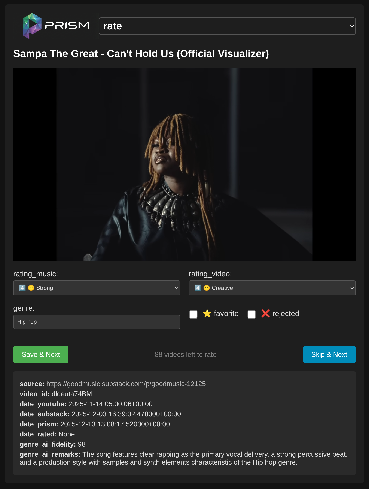
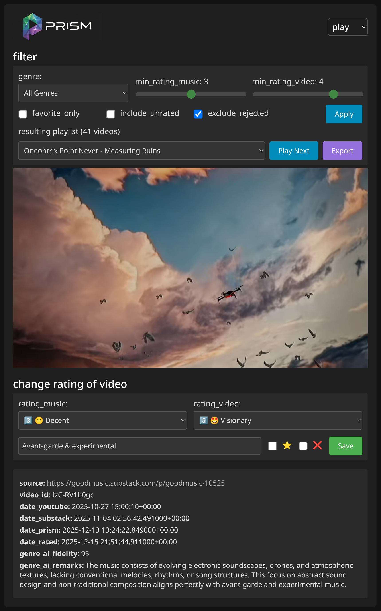

# GOODMUSIC prism

Tools for collecting YouTube music videos from Substack, seeding a Firestore catalog, creating YouTube playlists, and rating/filtering videos via a small Flask UI.

## Screenshots
<table>
  <tr>
    <th>rate</th>
    <th>play</th>
  </tr>
  <tr>
    <td valign="top"></td>
    <td valign="top"></td>
  </tr>
</table>


### rate



### filter & play




## Concept
- Scrape Substack posts, extract YouTube IDs, fetch metadata, and store them as documents in Firestore (`musicvideos` collection).
- Optionally let Vertex AI guess the genre.
- Build YouTube playlists automatically from Substack archives or local HTML.
- Rate and filter the catalog in a browser (play mode for discovery, rate mode for unrated items).

## Repository layout
- `prism-gui.py` — Flask app that renders the rating (`/rate`) and play (`/play`) pages using Firestore data.
- `scrape_to_firestore.py` — Scrapes Substack posts, pulls YouTube metadata, predicts genres/artist/track (Vertex AI), and writes new videos to Firestore.
- `scrape_to_YT-playlists.py` — Creates YouTube playlists from Substack archives or local HTML; tracks progress in `progress.json`. This script is deprecated and only included for historical reasons.
- `templates/` — HTML templates for the Flask UI.
- `requirements.txt` — Python dependencies.

## Prerequisites
- Python 3.10+ and `pip`.
- A Google Cloud project with these APIs enabled: Cloud Firestore, Vertex AI (optional for genre prediction), YouTube Data API v3.
- Firestore in Native mode with a collection named `musicvideos` (created automatically when seeding).
- Google Cloud SDK (`gcloud`) installed for local Application Default Credentials.
- YouTube OAuth 2.0 Client ID JSON (desktop type) downloaded as `client_secret.json` in the project root.

## Setup
```bash
git clone <this-repo>
cd GOODMUSIC
python -m venv venv
source venv/bin/activate
pip install -r requirements.txt
```

### Authenticate
- Google Cloud (Firestore/Vertex): `gcloud auth application-default login`
- YouTube Data API: first run of the playlist or scrape scripts opens a browser OAuth flow; `token.pickle` will be written next to the scripts.
- Set your project ID for the UI (and for scraping if you want to override ADC):
  ```bash
  export GCP_PROJECT=<your-project-id>
  ```

* Set username/password for the UI

  ```bash
  export AUTH_USERNAME=<your-username>
  export AUTH_PASSWORD=<your-password>
  ```

* You can set all of the above env-variables in an .env file permanently

### Required files

- `client_secret.json` — OAuth client for YouTube Data API v3 (Desktop app).
- `progress.json` — Created automatically to avoid duplicate playlist creation.

### Prepare Google Cloud Secrets
To secure the Flask UI in Cloud Run without exposing credentials in deployment commands:
1. Enable Secret Manager: `gcloud services enable secretmanager.googleapis.com`
2. Create secrets for the UI login:
   ```bash
   printf "your-username" | gcloud secrets create prism-auth-username --data-file=-
   printf "your-password" | gcloud secrets create prism-auth-password --data-file=-
   printf "your-project-id" | gcloud secrets create prism-auth-projectid --data-file=-
   ```
3. Grant the Compute Engine default service account access to the secrets (replace `<PROJECT_NUMBER>` with your project number):
   ```bash
   gcloud secrets add-iam-policy-binding prism-auth-username \
       --member="serviceAccount:<PROJECT_NUMBER>-compute@developer.gserviceaccount.com" \
       --role="roles/secretmanager.secretAccessor"
   gcloud secrets add-iam-policy-binding prism-auth-password \
       --member="serviceAccount:<PROJECT_NUMBER>-compute@developer.gserviceaccount.com" \
       --role="roles/secretmanager.secretAccessor"
   gcloud secrets add-iam-policy-binding prism-auth-projectid \
       --member="serviceAccount:<PROJECT_NUMBER>-compute@developer.gserviceaccount.com" \
       --role="roles/secretmanager.secretAccessor"
   ```

## Data model (Firestore `musicvideos`)
Each document key is the YouTube `video_id` and stores fields like:
- `title`, `source` (Substack URL), `genre`, `rating_music`, `rating_video`
- `artist`, `track`, `ai_model`, `genre_ai_fidelity`, `genre_ai_remarks`
- `favorite` (bool), `rejected` (bool)
- `date_prism`, `date_substack`, `date_youtube`, `date_rated`

## Scripts

### 0) Build YouTube playlists (deprecated)

`scrape_to_YT-playlists.py` creates playlists from Substack or a local HTML file; remembers processed posts in `progress.json`.

```bash
# From Substack archive
python scrape_to_YT-playlists.py --substack https://goodmusic.substack.com/archive \
  --privacy private --limit 10 --sleep 0.2

# From local HTML
python scrape_to_YT-playlists.py path/to/file.html --privacy unlisted
```

Flags:

- `--privacy private|unlisted|public`
- `--dry-run` to inspect without creating playlists
- `--limit` to cap posts/videos
- `--sleep` to throttle API calls
  Auth:
- Requires `client_secret.json`; first run writes `token.pickle`.
- Enable YouTube Data API v3 in your project.

### 1) Scrape Substack to Firestore
`scrape_to_firestore.py` fetches posts, extracts video IDs, fetches YouTube metadata, lets Vertex AI guess genre/artist/track, and writes new docs.
```bash
python scrape_to_firestore.py
  --substack: The URL of the Substack archive to scrape. Defaults to https://goodmusic.substack.com/archive.
  --project: The Google Cloud Project ID. If not provided, it attempts to infer it from the environment (ADC).
  --limit-substack-posts: Limits the number of Substack posts (articles) to process. Defaults to 0 (process all found posts). Useful for testing or incremental updates.
  --limit-new-db-entries: Limits the number of new videos added to Firestore in this run. Defaults to 0 (no limit). Useful to control costs or batch updates.
```
Notes:
- Uses ADC (`gcloud auth application-default login`) and `GCP_PROJECT`/`--project`.
- Needs `client_secret.json` for YouTube metadata; falls back gracefully if missing.
- Vertex AI genre prediction is optional; if unavailable, genre defaults to `Unknown`.

### 2) Flask UI

`prism-gui.py` serves:

- `/rate` — shows unrated videos (`musical_value == 0`) to rate.
- `/play` — lets you filter (genre, min ratings, favorites, unrated inclusion, rejected exclusion) and play/rate.
- `/admin` — hidden (has to be entered manually), shows some statistics

### 2a) Run the Flask UI locally

```bash
python prism-gui.py
# open http://127.0.0.1:8080
```
### 2b) Run the Flask UI in Google Cloud
```bash
gcloud run deploy prism-gui \
  --source . \
  --platform managed \
  --region europe-west4 \
  --allow-unauthenticated \
  --set-secrets="AUTH_USERNAME=prism-auth-username:latest,AUTH_PASSWORD=prism-auth-password:latest,PROJECT_ID=prism-auth-projectid:latest"
```

You will get a dynamic URL which you can then use to access the app. You can map a custom domain to the app (in GCC/Cloud Run/Domain Mappings).

## Operational tips

- Quotas: YouTube inserts and playlist creation consume quota; the playlist script stops and cleans up on `quotaExceeded`.
- Progress: `progress.json` prevents duplicate playlists; delete it if you want to rebuild everything.
- Tokens: remove `token.pickle` to force a new YouTube OAuth flow.
- Firestore indexes: filtering in the UI may require composite indexes if you add more complex queries; current filters use simple field filters.

## Troubleshooting
- “Video unavailable” in the UI: check the console for YouTube player errors; embedding may be blocked or the video ID malformed.
- Firestore permission errors: ensure the Firestore API is enabled and ADC credentials belong to a project with database access.
- Vertex AI errors: the scraper will continue; genres become `Unknown`.
