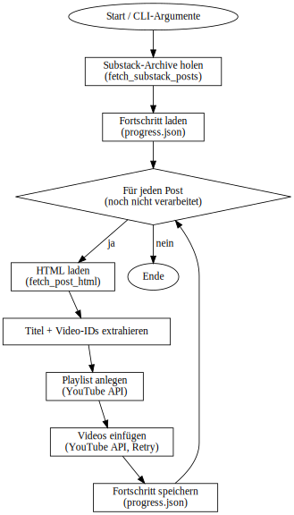

# 🎶 YouTube Playlist Builder für Substack

Dieses Python-Script erstellt automatisch **YouTube-Playlists** aus Substack-Beiträgen, die eingebettete YouTube-Videos enthalten.  
Es berücksichtigt die Limitierung des **YouTube Data API v3 Quotas** (10.000 Units pro Tag, 50 Units pro Video-Insert).

---

## Ablaufdiagramm

Das folgende Flowchart zeigt die Funktionsweise des Scripts:



## 🚀 Setup

1. **Repository / Script speichern**  
   Lege `playlist_from_html.py` in einen Projektordner, z. B.  
   ```
   ~/Documents/python-projekte/GOODMUSIC
   ```

2. **Virtuelle Umgebung erstellen**  
   ```bash
   python3 -m venv venv
   source venv/bin/activate
   ```

3. **Abhängigkeiten installieren**  
   ```bash
   pip install google-api-python-client google-auth google-auth-oauthlib requests beautifulsoup4
   ```

4. **OAuth-Credentials von Google Cloud Console**  
   - OAuth 2.0 Client anlegen (Typ „Webanwendung“).  
   - Redirect-URI hinzufügen: `http://localhost:8080/`  
   - JSON-Datei herunterladen und als `client_secret.json` im Projektordner ablegen.  

---

## ▶️ Nutzung

### 1. Lokale HTML-Datei verarbeiten
```bash
python playlist_from_html.py videos.html
```
- Erstellt eine Playlist aus den YouTube-Videos in `videos.html`.  
- Playlist-Name = Titel der Seite (`<title>` oder Substack-Titel).  

---

### 2. Direktes Auslesen von Substack-Archiven
```bash
python playlist_from_html.py --substack https://goodmusic.substack.com/archive
```
- Ruft alle Beiträge aus dem Substack-Archiv ab.  
- Erstellt für jeden Beitrag eine Playlist.  

Optionen:
- `--limit 3` → nur die letzten 3 Beiträge verarbeiten.  
- `--privacy public|unlisted|private` → Sichtbarkeit der Playlists.  
- `--sleep 0.5` → Pause zwischen API-Calls (Standard: 0.2s).  
- `--dry-run` → nur analysieren, nichts in YouTube anlegen.  

---

## 🛡️ Quota-Handling

- Jede Playlist-Erstellung + Video-Insert kostet API-Quota.  
- Sobald das Tageslimit erreicht ist, meldet die API: **`quotaExceeded` (403)**.  
- Script erkennt das, löscht unfertige Playlist und bricht sauber ab mit Hinweis:  
  ```
  ❌ Quota exhausted (quotaExceeded). Bitte morgen erneut starten.
  ```

---

## 💾 Fortschrittsdatei

- Fortschritt wird in `progress.json` gespeichert:  
  ```json
  {
    "processed_playlists": {
      "https://goodmusic.substack.com/p/goodmusic-8425": "PLxxxxxx",
      "https://goodmusic.substack.com/p/goodmusic-8325": "PLyyyyyy"
    }
  }
  ```
- **Vorteile:**
  - Keine doppelten Playlists.  
  - Script überspringt bereits verarbeitete Beiträge.  
  - Bei Quota-Abbruch wird die unfertige Playlist gelöscht und beim nächsten Lauf neu erstellt.  

---

## 📅 Workflow (empfohlen)

1. Virtuelle Umgebung aktivieren:  
   ```bash
   cd ~/Documents/python-projekte/GOODMUSIC
   source venv/bin/activate
   ```

2. Script starten:  
   ```bash
   python playlist_from_html.py --substack https://goodmusic.substack.com/archive
   ```

3. Script läuft, bis Quota erschöpft oder Archiv fertig.  
4. Am nächsten Tag wieder starten – Script macht dort weiter, wo es aufgehört hat.  

---

## ✅ Zusammenfassung

- Einmal einrichten → täglich starten.  
- Script erstellt automatisch für jeden Substack-Post eine Playlist.  
- Fortschritt bleibt erhalten, keine doppelten oder halbfertigen Playlists.  
- Bricht automatisch ab, wenn Quota erschöpft ist.  
